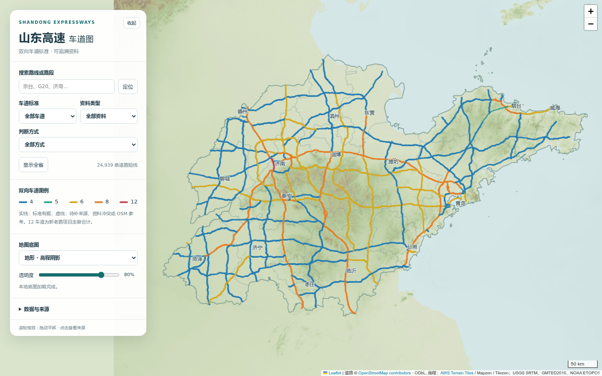

# 山东高速公路车道图

一个可以独立部署、方便核对和更新的山东高速公路车道地图。原生 HTML / CSS / JavaScript + 项目内的 Leaflet，无 npm 依赖、构建步骤、后台或 GIS Python 依赖。项目自带道路与资料快照。

**在线演示：[打开山东高速公路车道图](https://seanwong17.github.io/shandong-highway-map/)**



**About / 项目简介：** 交互式山东高速公路双向车道标准地图，可搜索路线、筛选路段并核查资料来源。An interactive map of Shandong expressway lane standards, with route search, filters, and traceable sources. [Live demo / 在线演示](https://seanwong17.github.io/shandong-highway-map/).

支持路线 / 路段搜索、车道 / 资料类型 / 判断方式组合筛选、定位、来源与改扩建详情、底图切换 / 透明度、筛选结果 GeoJSON 下载。手机默认收起筛选面板。

## 运行与部署

在本目录运行：

```bash
python3 -m http.server 8000
# Windows 也可用：py -m http.server 8000
```

打开 <http://localhost:8000>。使用当前版本 Chrome、Edge、Firefox 或 Safari；压缩数据使用浏览器原生 `DecompressionStream` 解压。最低支持 Chrome / Edge 80、Firefox 113、Safari 16.4。双击 HTML 的 `file://` 模式无法读取数据，应使用 HTTP 服务。

整个目录可直接部署到 GitHub Pages（选择 main 分支 / 根目录）或任意静态站点服务，不必构建。简洁、地形两张底图、Leaflet 和道路数据均保存在项目中；在无外网的 HTTP 环境下仍可显示地图、搜索与查看来源。两张 JPEG 均为 3584 × 2816 像素，按 Web Mercator 缩放级别 9 配准，地图最大显示级别为 9.5；道路是独立叠加的 OSM 矢量。道路数据不依赖原参考项目。

## 数据与维护

初始核对日期 **2026-09-30**，OSM 快照 **2026-09-29**：24,939 条道路短线、154 个依据项目、7 个改扩建项目。短线数不是高速条数或去重里程。展示为双向车道标准，包括历史基线和参考值；不代表当前实际开放车道。项目空间范围仍为近似匹配。

| 文件 | 如何维护 |
| --- | --- |
| `data/config.json` | 核对日期、数据版本、核验标志及颜色 |
| `data/projects.json` | 可读 JSON：项目标准、范围、日期、来源链接、引句、资料类型 |
| `data/expansions.json` | 可读 JSON：既有基线、扩建目标、施工状态、分段目标和依据 |
| `data/roads.geojson.gz` | 初始 WGS84 道路快照，gzip 压缩以减少下载量 |
| `data/province.geojson` | 山东省界，由下列 16 个地市多边形合并得到 |
| `data/cities.geojson` | 山东省 16 个地级市边界与标注位置，来自阿里云 DataV |
| `data/basemap.json` | 两张本地底图共用的 Web Mercator 边界、尺寸和原生缩放级别 |
| `data/updates.geojson` | 可读 GeoJSON：逐条修正、新建道路和停用记录，页面自动应用，无须构建 |

### 本地底图来源与重建

| 文件 | 来源与处理 |
| --- | --- |
| `assets/street.jpg` | [Natural Earth](https://www.naturalearthdata.com/) 的 10m 陆地、海岸、河流和湖泊数据自行绘制；公共领域 |
| `assets/terrain.jpg` | [AWS Terrain Tiles / Mapzen / Tilezen](https://registry.opendata.aws/terrain-tiles/) 的 Terrarium 高程瓦片，解码后生成分层设色与山体阴影；高程来源署名包括 USGS SRTM、GMTED2010、NOAA ETOPO1 |
| 叠加省界、地市界 | [阿里云 DataV 山东省下辖行政区 GeoJSON](https://geo.datav.aliyun.com/areas_v3/bound/370000_full.json)，16 个地级市；省界由地市多边形合并生成。两者均做了近似 GCJ-02 → WGS84 转换，仅作地图定位背景，不是法定界线成果；独立再分发许可尚未确认 |

重建时下载 Natural Earth `ne_10m_land.zip`、`ne_10m_coastline.zip`、`ne_10m_lakes.zip`、`ne_10m_rivers_lake_centerlines.zip`，解压到同一目录。高程瓦片地址为 `https://s3.amazonaws.com/elevation-tiles-prod/terrarium/{z}/{x}/{y}.png`，取 `z=9`、`x=418…431`、`y=195…205`，保存为 `x_y.png`。Terrarium PNG 编码的是高程数值，不能直接用作普通地图瓦片。

安装 Pillow、NumPy、GeoPandas、Shapely 后运行：

```bash
python3 tools/build_basemaps.py --natural-earth /path/to/natural-earth --terrarium /path/to/tiles
```

此命令重建两张 JPEG 和 `data/basemap.json`。这些依赖仅用于重新绘图，运行网页不需要安装。

如需重建省界和地市界，下载上表的 DataV GeoJSON 后运行 `python3 tools/import_datav_boundaries.py /path/to/370000_full.json`。脚本需要 Shapely；原始接口数据不随仓库保存。

每次更新：先检查原文，修改项目依据，再修改道路记录；更新 `config.json` 的 `data_version` 和 `source_checked_on`。日期表示维护者完成资料核对的时间，不能仅刷新网页就改为当天；整体及空间核验标志不得因地图已有颜色而改为 true。

在本目录检查：

```bash
python3 tools/check.py
node tests/data.test.mjs
node tests/app.test.mjs
```

Python 检查 ID、项目关联、坐标、车道值、来源、日期和更新理由。Node 测试验证初始快照数量、组合筛选、来源转义、分段扩建目标、更新应用及页面加载 / 事件流程；变更真实路网后应相应更新测试中的快照期望值。测试工具均只使用标准库；页面流程测试需要 Node 18+，使用 DOM / Leaflet 替身，不代替真实浏览器显示检查。

### 核对和修正既有道路

点击路段，使用 OSM 线 ID 查找原几何，查看项目、范围和原文引句。新资料应在 `projects.json` 新增独立依据项目（建议使用 `P156` 等唯一 ID），保留旧项目及日期；改用新依据时让道路引用新项目。每个项目至少填写现有记录的 `id`、`name`、`scope`、`lanes`、`published`、`checked_on`、`source_url`、`quote`、`evidence_group`。`evidence` 可保存多个来源；证据类型为 `fulltext`、`preview`、`excerpt`、`inference`、`secondary` 或 `unknown`，没有全文证据时不标成全文。

例如，某段扩建通车且已核对为双向八车道，在 `updates.geojson` 的 `features` 内增加如下记录。示例 ID、项目与日期应替换为实际值，不能直接当作现状提交：

```json
{
  "type": "Feature",
  "id": "26247975",
  "geometry": null,
  "properties": {
    "project_id": "P156",
    "lanes_documented": 8,
    "lane_source": "project_range",
    "line_style": "solid",
    "lane_conflict": false,
    "checked_on": "2026-10-06",
    "update_note": "核对正式通车公告，改用八车道通车标准"
  }
}
```

`id` 为原 OSM 线 ID 的字符串；`geometry: null` 保留原几何，其余属性与原记录合并。一项工程涉及多条短线时逐条指定准确 ID，不直接按整条路线编号覆盖。改变主项目或车道时也应检查 `overlapping_project_ids`、候选值差异和线型，不能机械沿用旧判断。同一 ID 只保留一条当前修正，历史通过 Git 提交保存。

仅部分短线受影响时，应拆分几何：停用原 ID，新增多个有独立 ID 的短线，分别关联依据；不把整条 OSM 线全部着色成局部标准。GeoJSON 可在 QGIS 等工具内编辑；坐标顺序为 `[经度, 纬度]`，坐标系 WGS84（EPSG:4326）。

### 改扩建、新建和停用

- **正在改扩建**：在 `expansions.json` 增加 `expansion_active` 记录，用 `matched_project_ids` 关联既有项目。地图继续显示既有基线；`target_lanes` 是设计目标，不提前作为通车标准。目标分段不同，用 `target_lanes_by_project`，其他匹配段可用 `default_target_lanes`。
- **扩建已通车**：新增通车依据、修正实际受影响短线；从活跃改扩建列表移出完成记录，历史留在 Git。分段通车应把活跃记录拆成仍在施工的范围，不把全项目一次性完成。
- **新建已通车**：在 `updates.geojson` 增加 `LineString`，使用 `local:项目名:序号` 这类唯一 ID，填写 `ref`、`name`、`project_id`、`lanes_documented`、`lane_source`、`line_style`、`checked_on`、`update_note`，并在项目表记录正式通车依据。具有 OSM 线 ID 时可额外填 `osm_id`。规划 / 尚未通车的新建线路不进入本项目的已通车图层。
- **旧线停用或被替代**：增加相同 ID、`geometry: null`，属性填 `retired: true`、`checked_on` 和 `update_note`。它从显示路网移除，更新记录仍保留；拆分替换时同时添加新几何。

新增线示例见 [维护示例](docs/update-example.geojson)。它是演示数据，不会被页面自动加载。道路修正应用顺序是“初始快照 → 更新记录”，项目 JSON 修改刷新即生效。

若需要整理大量原始几何，可用 Python 标准库解压 / 压缩：

```python
import gzip
from pathlib import Path
path = Path("data/roads.geojson.gz")
Path("roads.geojson").write_bytes(gzip.decompress(path.read_bytes()))
# 编辑完成并核对后：
path.write_bytes(gzip.compress(Path("roads.geojson").read_bytes(), mtime=0))
```

小范围更新优先使用更新表；批量替换快照时避免把同一条道路同时放入新快照和新增记录，复核所有旧 ID 的修正关联。压缩文件采用固定 gzip 时间以方便重复生成和校验。

## 制作其他省份或地区：标准做法

1. **先确定口径**。规定区域、资料核对日期、双向 / 单向含义、纳入运营范围及例外。已通车道路、历史标准、施工目标、未通车计划分别记录。双向分离的 OSM 几何不能简单按 `lanes × 2` 得出现状，也不能把两幅路的几何长度直接相加当作运营里程。
2. **整理道路几何**。从 OSM 等许可明确的来源取得区域主线，统一成 WGS84 `LineString`，保留可追溯 ID。排除匝道或另立图层；按枢纽、车道变化和工程范围切分，并记录相邻或重叠项目，避免共线道路重复统计。
3. **建立依据台账**。每条结论保存原文链接、关键引句、适用范围、发布日期、核对日期和证据类型。优先正式通车公告、主管部门及运营单位资料。搜索摘要或相邻项目推断须单列；同编号的高速可能有多个车道标准，不能仅凭路线名推广到全线。
4. **完成空间匹配**。按起终点、枢纽、桥梁和桩号把依据关联到具体短线。未精确匹配的记录明确标为近似范围；可靠标准实线，待确认或参考值虚线。来源可信度与空间匹配精度是不同维度，不因取得全文就声称空间范围已核实。
5. **用本项目结构实现展示**。替换 `data/` 中的道路、项目、扩建记录和配置。修改标题、来源说明、图例及初始视角 `[36.3,118.5]`；页面最终会按路网范围自动定位。改变车道类别时同步修改 `index.html` 选项、`config.json` 色表与 `tools/check.py` 的 `LANES`，并替换快照测试期望。界线若需要单独加入，应先明确其再分发许可。
6. **验证与发布**。运行数据检查，抽查不同车道、虚线、共线、分段目标以及移动端。确认道路和本地底图坐标匹配、两张图片正常加载并保留来源署名。把静态目录发布到所选平台；代码许可与数据许可分别说明。
7. **持续更新**。以“依据项目 → 精确路段 → 更新理由 / 日期 → 校验 → Git 提交”作为一次更新。保留旧依据，用独立更新表修正显示；定期检查来源失效、工程进展和分段通车。校验命令只检查结构和关联，不能替代真实资料核对。

## 项目结构与许可

`index.html`、`style.css` 为界面，`app.mjs` 为地图逻辑，`core.mjs` 为筛选、来源弹窗和更新规则。`assets/` 保存两张底图，`tools/build_basemaps.py` 可从源数据重建图片。`tools/import_snapshot.py` 是首次提取参考数据的标准库工具；已随项目提供完成的快照，正常使用和后续维护不需要原项目，也不需重新导入。工具会拒绝覆盖已有维护数据。

原创代码 [MIT](LICENSE)，OSM 衍生道路数据 ODbL；第三方服务和公告引句见 [NOTICE](NOTICE.md)。贡献数据时提交可核对的链接、引句、具体路段 ID 和更新理由。
